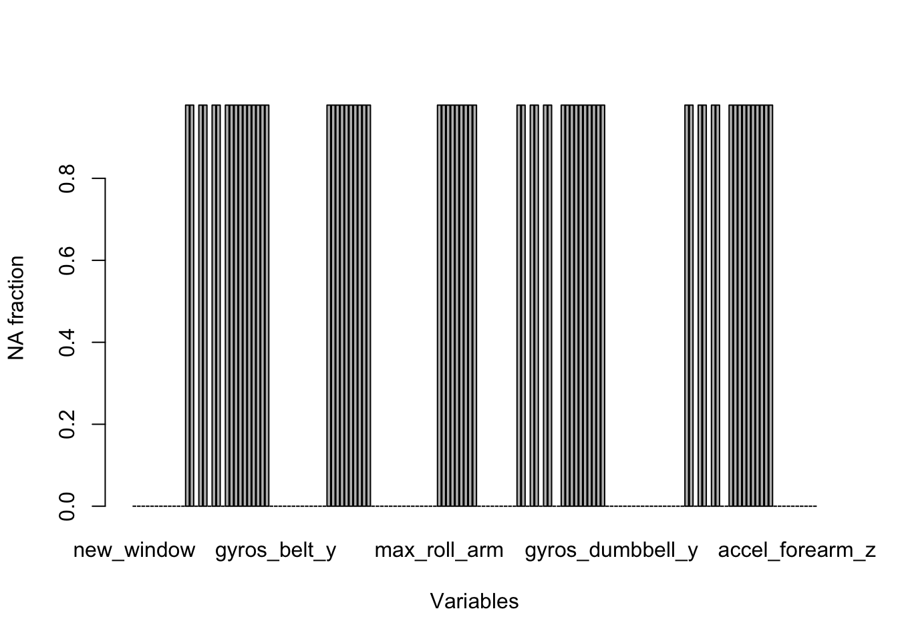

# Practical Machine Learning Course Project

## Introduction

The goal of this project is to predict the manner in which the people did the exercise. This is the "classe" variable in the training set. 

The training data for this project are available [here](https://d396qusza40orc.cloudfront.net/predmachlearn/pml-training.csv).

The test data are available [here](https://d396qusza40orc.cloudfront.net/predmachlearn/pml-testing.csv).

## Loading data

First, we will load the caret package, which is required for the model optimization
and data analysis.


```r
library(caret)
```

```
## Loading required package: lattice
## Loading required package: ggplot2
```

```r
library(knitr)
```

The next step is to read both train and test data sets:


```r
trainData <- read.csv("pml-training.csv")
testData <- read.csv("pml-testing.csv")
```

## Data processing

Now we will split the training data set into the training and cross-validation 
subset for the out-of-the-box error estimation. We will use 60% of the data
for the training, and the remaining 40% for the cv.


```r
set.seed(123)
cvIds <- createDataPartition(trainData$classe, p = 0.4, list = F)
cvData <- trainData[cvIds,]
trainData2 <- trainData[-cvIds,]
```

Now the data are ready for the analysis. First of all, we will look at their structure:


```r
str(trainData2)
```

```
## 'data.frame':	11772 obs. of  160 variables:
##  $ X                       : int  1 2 5 7 8 9 10 12 14 15 ...
##  $ user_name               : Factor w/ 6 levels "adelmo","carlitos",..: 2 2 2 2 2 2 2 2 2 2 ...
##  $ raw_timestamp_part_1    : int  1323084231 1323084231 1323084232 1323084232 1323084232 1323084232 1323084232 1323084232 1323084232 1323084232 ...
##  $ raw_timestamp_part_2    : int  788290 808298 196328 368296 440390 484323 484434 528316 576390 604281 ...
##  $ cvtd_timestamp          : Factor w/ 20 levels "02/12/2011 13:32",..: 9 9 9 9 9 9 9 9 9 9 ...
##  $ new_window              : Factor w/ 2 levels "no","yes": 1 1 1 1 1 1 1 1 1 1 ...
##  $ num_window              : int  11 11 12 12 12 12 12 12 12 12 ...
##  $ roll_belt               : num  1.41 1.41 1.48 1.42 1.42 1.43 1.45 1.43 1.42 1.45 ...
##  $ pitch_belt              : num  8.07 8.07 8.07 8.09 8.13 8.16 8.17 8.18 8.21 8.2 ...
##  $ yaw_belt                : num  -94.4 -94.4 -94.4 -94.4 -94.4 -94.4 -94.4 -94.4 -94.4 -94.4 ...
##  $ total_accel_belt        : int  3 3 3 3 3 3 3 3 3 3 ...
##  $ kurtosis_roll_belt      : Factor w/ 397 levels "","-0.016850",..: 1 1 1 1 1 1 1 1 1 1 ...
##  $ kurtosis_picth_belt     : Factor w/ 317 levels "","-0.021887",..: 1 1 1 1 1 1 1 1 1 1 ...
##  $ kurtosis_yaw_belt       : Factor w/ 2 levels "","#DIV/0!": 1 1 1 1 1 1 1 1 1 1 ...
##  $ skewness_roll_belt      : Factor w/ 395 levels "","-0.003095",..: 1 1 1 1 1 1 1 1 1 1 ...
##  $ skewness_roll_belt.1    : Factor w/ 338 levels "","-0.005928",..: 1 1 1 1 1 1 1 1 1 1 ...
##  $ skewness_yaw_belt       : Factor w/ 2 levels "","#DIV/0!": 1 1 1 1 1 1 1 1 1 1 ...
##  $ max_roll_belt           : num  NA NA NA NA NA NA NA NA NA NA ...
##  $ max_picth_belt          : int  NA NA NA NA NA NA NA NA NA NA ...
##  $ max_yaw_belt            : Factor w/ 68 levels "","-0.1","-0.2",..: 1 1 1 1 1 1 1 1 1 1 ...
##  $ min_roll_belt           : num  NA NA NA NA NA NA NA NA NA NA ...
##  $ min_pitch_belt          : int  NA NA NA NA NA NA NA NA NA NA ...
##  $ min_yaw_belt            : Factor w/ 68 levels "","-0.1","-0.2",..: 1 1 1 1 1 1 1 1 1 1 ...
##  $ amplitude_roll_belt     : num  NA NA NA NA NA NA NA NA NA NA ...
##  $ amplitude_pitch_belt    : int  NA NA NA NA NA NA NA NA NA NA ...
##  $ amplitude_yaw_belt      : Factor w/ 4 levels "","#DIV/0!","0.00",..: 1 1 1 1 1 1 1 1 1 1 ...
##  $ var_total_accel_belt    : num  NA NA NA NA NA NA NA NA NA NA ...
##  $ avg_roll_belt           : num  NA NA NA NA NA NA NA NA NA NA ...
##  $ stddev_roll_belt        : num  NA NA NA NA NA NA NA NA NA NA ...
##  $ var_roll_belt           : num  NA NA NA NA NA NA NA NA NA NA ...
##  $ avg_pitch_belt          : num  NA NA NA NA NA NA NA NA NA NA ...
##  $ stddev_pitch_belt       : num  NA NA NA NA NA NA NA NA NA NA ...
##  $ var_pitch_belt          : num  NA NA NA NA NA NA NA NA NA NA ...
##  $ avg_yaw_belt            : num  NA NA NA NA NA NA NA NA NA NA ...
##  $ stddev_yaw_belt         : num  NA NA NA NA NA NA NA NA NA NA ...
##  $ var_yaw_belt            : num  NA NA NA NA NA NA NA NA NA NA ...
##  $ gyros_belt_x            : num  0 0.02 0.02 0.02 0.02 0.02 0.03 0.02 0.02 0 ...
##  $ gyros_belt_y            : num  0 0 0.02 0 0 0 0 0 0 0 ...
##  $ gyros_belt_z            : num  -0.02 -0.02 -0.02 -0.02 -0.02 -0.02 0 -0.02 -0.02 0 ...
##  $ accel_belt_x            : int  -21 -22 -21 -22 -22 -20 -21 -22 -22 -21 ...
##  $ accel_belt_y            : int  4 4 2 3 4 2 4 2 4 2 ...
##  $ accel_belt_z            : int  22 22 24 21 21 24 22 23 21 22 ...
##  $ magnet_belt_x           : int  -3 -7 -6 -4 -2 1 -3 -2 -8 -1 ...
##  $ magnet_belt_y           : int  599 608 600 599 603 602 609 602 598 597 ...
##  $ magnet_belt_z           : int  -313 -311 -302 -311 -313 -312 -308 -319 -310 -310 ...
##  $ roll_arm                : num  -128 -128 -128 -128 -128 -128 -128 -128 -128 -129 ...
##  $ pitch_arm               : num  22.5 22.5 22.1 21.9 21.8 21.7 21.6 21.5 21.4 21.4 ...
##  $ yaw_arm                 : num  -161 -161 -161 -161 -161 -161 -161 -161 -161 -161 ...
##  $ total_accel_arm         : int  34 34 34 34 34 34 34 34 34 34 ...
##  $ var_accel_arm           : num  NA NA NA NA NA NA NA NA NA NA ...
##  $ avg_roll_arm            : num  NA NA NA NA NA NA NA NA NA NA ...
##  $ stddev_roll_arm         : num  NA NA NA NA NA NA NA NA NA NA ...
##  $ var_roll_arm            : num  NA NA NA NA NA NA NA NA NA NA ...
##  $ avg_pitch_arm           : num  NA NA NA NA NA NA NA NA NA NA ...
##  $ stddev_pitch_arm        : num  NA NA NA NA NA NA NA NA NA NA ...
##  $ var_pitch_arm           : num  NA NA NA NA NA NA NA NA NA NA ...
##  $ avg_yaw_arm             : num  NA NA NA NA NA NA NA NA NA NA ...
##  $ stddev_yaw_arm          : num  NA NA NA NA NA NA NA NA NA NA ...
##  $ var_yaw_arm             : num  NA NA NA NA NA NA NA NA NA NA ...
##  $ gyros_arm_x             : num  0 0.02 0 0 0.02 0.02 0.02 0.02 0.02 0.02 ...
##  $ gyros_arm_y             : num  0 -0.02 -0.03 -0.03 -0.02 -0.03 -0.03 -0.03 0 0 ...
##  $ gyros_arm_z             : num  -0.02 -0.02 0 0 0 -0.02 -0.02 0 -0.03 -0.03 ...
##  $ accel_arm_x             : int  -288 -290 -289 -289 -289 -288 -288 -288 -288 -289 ...
##  $ accel_arm_y             : int  109 110 111 111 111 109 110 111 111 111 ...
##  $ accel_arm_z             : int  -123 -125 -123 -125 -124 -122 -124 -123 -124 -124 ...
##  $ magnet_arm_x            : int  -368 -369 -374 -373 -372 -369 -376 -363 -371 -374 ...
##  $ magnet_arm_y            : int  337 337 337 336 338 341 334 343 331 342 ...
##  $ magnet_arm_z            : int  516 513 506 509 510 518 516 520 523 510 ...
##  $ kurtosis_roll_arm       : Factor w/ 330 levels "","-0.02438",..: 1 1 1 1 1 1 1 1 1 1 ...
##  $ kurtosis_picth_arm      : Factor w/ 328 levels "","-0.00484",..: 1 1 1 1 1 1 1 1 1 1 ...
##  $ kurtosis_yaw_arm        : Factor w/ 395 levels "","-0.01548",..: 1 1 1 1 1 1 1 1 1 1 ...
##  $ skewness_roll_arm       : Factor w/ 331 levels "","-0.00051",..: 1 1 1 1 1 1 1 1 1 1 ...
##  $ skewness_pitch_arm      : Factor w/ 328 levels "","-0.00184",..: 1 1 1 1 1 1 1 1 1 1 ...
##  $ skewness_yaw_arm        : Factor w/ 395 levels "","-0.00311",..: 1 1 1 1 1 1 1 1 1 1 ...
##  $ max_roll_arm            : num  NA NA NA NA NA NA NA NA NA NA ...
##  $ max_picth_arm           : num  NA NA NA NA NA NA NA NA NA NA ...
##  $ max_yaw_arm             : int  NA NA NA NA NA NA NA NA NA NA ...
##  $ min_roll_arm            : num  NA NA NA NA NA NA NA NA NA NA ...
##  $ min_pitch_arm           : num  NA NA NA NA NA NA NA NA NA NA ...
##  $ min_yaw_arm             : int  NA NA NA NA NA NA NA NA NA NA ...
##  $ amplitude_roll_arm      : num  NA NA NA NA NA NA NA NA NA NA ...
##  $ amplitude_pitch_arm     : num  NA NA NA NA NA NA NA NA NA NA ...
##  $ amplitude_yaw_arm       : int  NA NA NA NA NA NA NA NA NA NA ...
##  $ roll_dumbbell           : num  13.1 13.1 13.4 13.1 12.8 ...
##  $ pitch_dumbbell          : num  -70.5 -70.6 -70.4 -70.2 -70.3 ...
##  $ yaw_dumbbell            : num  -84.9 -84.7 -84.9 -85.1 -85.1 ...
##  $ kurtosis_roll_dumbbell  : Factor w/ 398 levels "","-0.0035","-0.0073",..: 1 1 1 1 1 1 1 1 1 1 ...
##  $ kurtosis_picth_dumbbell : Factor w/ 401 levels "","-0.0163","-0.0233",..: 1 1 1 1 1 1 1 1 1 1 ...
##  $ kurtosis_yaw_dumbbell   : Factor w/ 2 levels "","#DIV/0!": 1 1 1 1 1 1 1 1 1 1 ...
##  $ skewness_roll_dumbbell  : Factor w/ 401 levels "","-0.0082","-0.0096",..: 1 1 1 1 1 1 1 1 1 1 ...
##  $ skewness_pitch_dumbbell : Factor w/ 402 levels "","-0.0053","-0.0084",..: 1 1 1 1 1 1 1 1 1 1 ...
##  $ skewness_yaw_dumbbell   : Factor w/ 2 levels "","#DIV/0!": 1 1 1 1 1 1 1 1 1 1 ...
##  $ max_roll_dumbbell       : num  NA NA NA NA NA NA NA NA NA NA ...
##  $ max_picth_dumbbell      : num  NA NA NA NA NA NA NA NA NA NA ...
##  $ max_yaw_dumbbell        : Factor w/ 73 levels "","-0.1","-0.2",..: 1 1 1 1 1 1 1 1 1 1 ...
##  $ min_roll_dumbbell       : num  NA NA NA NA NA NA NA NA NA NA ...
##  $ min_pitch_dumbbell      : num  NA NA NA NA NA NA NA NA NA NA ...
##  $ min_yaw_dumbbell        : Factor w/ 73 levels "","-0.1","-0.2",..: 1 1 1 1 1 1 1 1 1 1 ...
##  $ amplitude_roll_dumbbell : num  NA NA NA NA NA NA NA NA NA NA ...
##   [list output truncated]
```

From this pretty long output we can see, that the first five variables contain
technical data and are bad predictors, so we will remove them. 


```r
removeCols1 <- c(1:5)
trainData2 <- trainData2[,-removeCols1]
```

Then, in several variables there are lots of NAs, so we will evaluate this in more 
detail.


```r
barplot(sapply(trainData2, function(x){sum(is.na(x))/length(x)}),
        ylab = "NA fraction", xlab = "Variables")
```

 

From this plot it is clear, that several variables contain only NAs, and thus pose little value for the analysis. We will remove them as well using a custom function to generate an appropriate id list.


```r
removeNaF <- function(x){
    out <- c()
    l <- length(x[1,])
    for(i in 1:l){
        if(sum(is.na(x[,i]))/length(x[,i])>0.3){
            out <- c(out, i)
        }
    }
    out
}
removeCols2 <- removeNaF(trainData2)
trainData2 <- trainData2[,-removeCols2]
```

Finally, we also remove the variables wit near-zero variance as poor predictors.


```r
removeCols3 <- nearZeroVar(trainData2)
trainData2 <- trainData2[,-removeCols3]
```

## Model fitting

To predict the manner of the excercise, we will use the random forest method, because
it is well suited for classification tasks and has both low variance and low bias.
For the model parameters optimization, we will use the 4-fold cross-validation.


```r
model <- train(classe~., data = trainData2, method = "rf", 
               trControl=trainControl(method = "cv", number = 4))
```

```
## Loading required namespace: e1071
```

To evaluate the prediction error of the model, we will use the cv dataset created earlier.
We will apply for it all the variable removing steps from the training stage.


```r
cvData2 <- cvData[,-removeCols1]
cvData2 <- cvData2[,-removeCols2]
cvData2 <- cvData2[,-removeCols3]
trainPred <- predict(model, cvData2)
```

The efficiency of the prediction is presented in the following table:


```r
confusionMatrix(trainPred, cvData2$classe) 
```

```
## Confusion Matrix and Statistics
## 
##           Reference
## Prediction    A    B    C    D    E
##          A 2232    8    0    0    0
##          B    0 1511    2    0    0
##          C    0    0 1366    7    0
##          D    0    0    1 1280    5
##          E    0    0    0    0 1438
## 
## Overall Statistics
##                                           
##                Accuracy : 0.9971          
##                  95% CI : (0.9956, 0.9981)
##     No Information Rate : 0.2843          
##     P-Value [Acc > NIR] : < 2.2e-16       
##                                           
##                   Kappa : 0.9963          
##  Mcnemar's Test P-Value : NA              
## 
## Statistics by Class:
## 
##                      Class: A Class: B Class: C Class: D Class: E
## Sensitivity            1.0000   0.9947   0.9978   0.9946   0.9965
## Specificity            0.9986   0.9997   0.9989   0.9991   1.0000
## Pos Pred Value         0.9964   0.9987   0.9949   0.9953   1.0000
## Neg Pred Value         1.0000   0.9987   0.9995   0.9989   0.9992
## Prevalence             0.2843   0.1935   0.1744   0.1639   0.1838
## Detection Rate         0.2843   0.1925   0.1740   0.1631   0.1832
## Detection Prevalence   0.2854   0.1927   0.1749   0.1638   0.1832
## Balanced Accuracy      0.9993   0.9972   0.9984   0.9968   0.9983
```

The prediction error rate on the test data set is 
0.3%.

## Output generation

The final stage is the generation of predictions for the test dataset and packing them into
separate files.


```r
testData2 <- testData[,-removeCols1]
testData2 <- testData2[,-removeCols2]
testData2 <- testData2[,-removeCols3]

answers = predict(model, testData2)

pml_write_files = function(x){
  n = length(x)
  for(i in 1:n){
    filename = paste0("problem_id_",i,".txt")
    write.table(x[i],file=filename,quote=FALSE,row.names=FALSE,col.names=FALSE)
  }
}
pml_write_files(answers)
```

